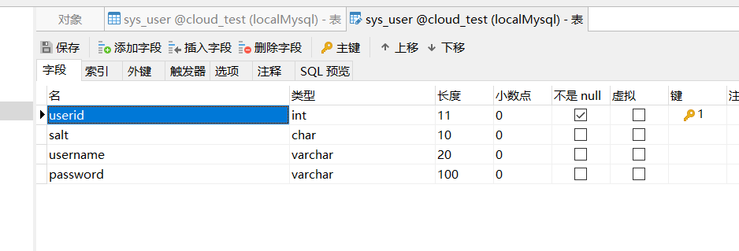
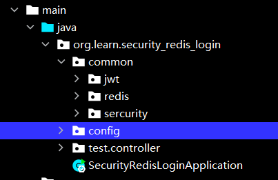
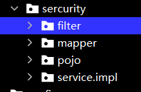
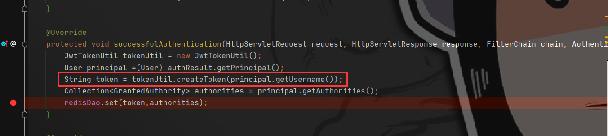
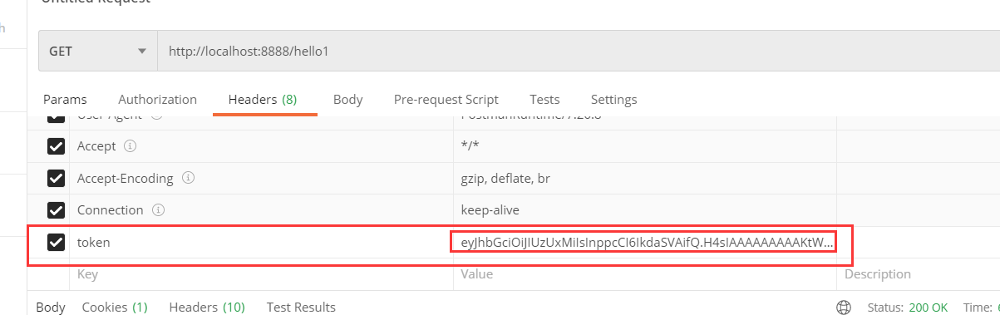

# spring-security-redis-jwt

spring-security简单整合redis实现通过jwt单点登录

目标是学习jwt令牌进行单点登录验证

学习课程来自尚硅谷哔哩哔哩免费课程[尚硅谷SpringSecurity框架教程（spring security源码剖析从入门到精通）](https://www.bilibili.com/video/BV15a411A7kP)感激

最后小小吐槽一下，老师的细节讲的不是特别好，尤其是HttpSecurity。。。

这是我为了学习使用的项目，所有的一切都以最简单的方法实现

大家学完可以来拉我的项目试试跑起来，添加自己的配置等

我在最后提了些扩展方向，大家有兴趣也可以试试

## 背景

讲一下为啥要使用redis：

默认一个项目是将登录认证缓存在session中的，session虽然在内存中，但是被单一项目持有（jvm相关）

所以如果我只在项目A进行了登录，那么对于项目B来说我是未登录的，这样就无法实现单点登录，对应也就无法实现微服务和分布式架构了

当使用redis将登录认证信息跟唯一token绑定时，只有用户端（比如浏览器的cookie）持有token，那么对所有使用该redis进行认证的应用来说，该用户端都是登录状态

这就是我进行本实验的目的

## 数据结构

唯一的一张表结构，省去一切能省的东西

这里权限我是写死在UserDetailLoginServiceImpl中的



## pom

简单的整合了web-security-mybatis-mysqlconnect-redis-jjwt

```xml
<dependencies>
    <dependency>
        <groupId>org.springframework.boot</groupId>
        <artifactId>spring-boot-starter-data-redis</artifactId>
    </dependency>
    <dependency>
        <groupId>org.springframework.boot</groupId>
        <artifactId>spring-boot-starter-security</artifactId>
    </dependency>
    <dependency>
        <groupId>org.springframework.boot</groupId>
        <artifactId>spring-boot-starter-web</artifactId>
    </dependency>
    <dependency>
        <groupId>org.mybatis.spring.boot</groupId>
        <artifactId>mybatis-spring-boot-starter</artifactId>
        <version>2.2.0</version>
    </dependency>

    <dependency>
        <groupId>mysql</groupId>
        <artifactId>mysql-connector-java</artifactId>
        <scope>runtime</scope>
    </dependency>
    <dependency>
        <groupId>org.projectlombok</groupId>
        <artifactId>lombok</artifactId>
        <optional>true</optional>
    </dependency>
    <dependency>
        <groupId>org.springframework.boot</groupId>
        <artifactId>spring-boot-starter-test</artifactId>
        <scope>test</scope>
    </dependency>
    <dependency>
        <groupId>org.springframework.security</groupId>
        <artifactId>spring-security-test</artifactId>
        <scope>test</scope>
    </dependency>

    <dependency>
        <groupId>io.jsonwebtoken</groupId>
        <artifactId>jjwt</artifactId>
        <version>0.9.1</version>
    </dependency>
</dependencies>

<build>
    <plugins>
        <plugin>
            <groupId>org.springframework.boot</groupId>
            <artifactId>spring-boot-maven-plugin</artifactId>
            <configuration>
                <excludes>
                    <exclude>
                        <groupId>org.projectlombok</groupId>
                        <artifactId>lombok</artifactId>
                    </exclude>
                </excludes>
            </configuration>
        </plugin>
    </plugins>
    <!-- xml资源目录配置 -->
    <resources>
        <resource>
            <directory>src/main/resources</directory>
            <filtering>true</filtering>
        </resource>
        <resource>
            <directory>src/main/java</directory>
            <includes>
                <include>**/*.xml</include>
            </includes>
        </resource>
    </resources>
</build>
```

## yml

yml文件，配置了端口、数据库、redis和mybatis的xml位置

```yml
server:
  port: 8888
spring:
  datasource:
    driver-class-name: com.mysql.cj.jdbc.Driver
    url: jdbc:mysql://localhost:3306/cloud_test?serverTimezone=Asia/Shanghai
    username: root
    password: toor
  redis:
    host: 127.0.0.1
mybatis:
  mapper-locations: classpath*:org/learn/security_redis_login/**/mapper/xml/*.xml
```

## 项目目录结构



jwt中是jwtToken的编译解析工具

redis里面是一个普通的redis存储获取的工具

security里面装的是：

​			登录、认证两个过滤器；user实体类；UserDetailsService实现类及userDetailMapper

			>这里注意一下，因为UserDetails的默认实现中没有username+password的两参构造器，且没有无参构造器，
			>
			>所以mybatis的xml进行映射实体类时会出错，这里我写的SysUser作用就是重写构造器，实际上完全可以使用跟数据库对应的实体类UserDO
			>
			>这里我直接使用继承security的user是因为重写简单，项目定义的User实体跟UserDetail同系，是因为如果涉及其他操作起来更简单，但实际上，没有其他操作了。后面再考虑改不改



config里是redis通用配置和security配置

test.controller里面是测试权限和验证用的test


## ApplicationMain

```java
@SpringBootApplication
@MapperScan("org.learn.security_redis_login.**.mapper")
public class SecurityRedisLoginApplication {

    public static void main(String[] args) {
        SpringApplication.run(SecurityRedisLoginApplication.class, args);
    }

}
```

## SecurityConfig

```java
@Configuration
public class SecurityConfig extends WebSecurityConfigurerAdapter {

    @Autowired
    private RedisDao redisDao;
    @Override
    protected void configure(HttpSecurity http) throws Exception {
        http.addFilter(new TokenLoginFilter(redisDao,this.authenticationManager())).addFilter(new TokenAuthFilter(this.authenticationManager(),redisDao));

        http.formLogin().permitAll().and().authorizeRequests().antMatchers("/","/login/**").permitAll().anyRequest().authenticated();
    }

    //默认启动后项目里是没有密码编码器的，自己选一个其实现类或者自己写一个，注入容器中
    @Bean
    public PasswordEncoder passwordEncoder(){
        return new BCryptPasswordEncoder();
    }
}
```

## RedisConfig

```java
@Configuration
public class RedisConfig {


    @Bean
    public RedisTemplate<Object, Object> redisTemplate(RedisConnectionFactory factory){
        RedisTemplate<Object, Object> template = new RedisTemplate<>();
        template.setConnectionFactory(factory);

        Jackson2JsonRedisSerializer<Object> jackson2JsonRedisSerializer = this.jackson2JsonRedisSerializer();

        //String序列化
        StringRedisSerializer stringRedisSerializer = new StringRedisSerializer();
        //key采用string的序列化方式
        template.setKeySerializer(stringRedisSerializer);
        //hash的key采用string的序列化方式
        template.setHashKeySerializer(stringRedisSerializer);
        //value序列化也采用jackson
        template.setValueSerializer(jackson2JsonRedisSerializer);
        //hash的value也采用jackson
        template.setHashValueSerializer( jackson2JsonRedisSerializer);
        template.afterPropertiesSet();

        return template;
    }

    /**
     * 自定义jackson2JsonRedisSerializer对象
     * @return jackson2JsonRedisSerializer
     */
    private Jackson2JsonRedisSerializer<Object> jackson2JsonRedisSerializer() {
        Jackson2JsonRedisSerializer<Object> jackson2JsonRedisSerializer =
                new Jackson2JsonRedisSerializer<>(Object.class);

        ObjectMapper objectMapper = new ObjectMapper();
        objectMapper.setVisibility(PropertyAccessor.ALL, JsonAutoDetect.Visibility.ANY);
        objectMapper.configure(MapperFeature.USE_ANNOTATIONS, false);
        objectMapper.configure(DeserializationFeature.FAIL_ON_UNKNOWN_PROPERTIES, false);
        objectMapper.configure(SerializationFeature.FAIL_ON_EMPTY_BEANS, false);
        // 此项必须配置，否则会报java.lang.ClassCastException: java.util.LinkedHashMap cannot be cast to XXX
        objectMapper.activateDefaultTyping(LaissezFaireSubTypeValidator.instance,ObjectMapper.DefaultTyping.NON_FINAL
                , JsonTypeInfo.As.PROPERTY);
        objectMapper.setSerializationInclusion(JsonInclude.Include.NON_NULL);
        jackson2JsonRedisSerializer.setObjectMapper(objectMapper);
        return jackson2JsonRedisSerializer;
    }
```


## TokenAuthFilter 验证过滤器

```java
public class TokenAuthFilter extends BasicAuthenticationFilter {

    private RedisDao redisDao;


    //代码要求必须重写
    public TokenAuthFilter(AuthenticationManager authenticationManager,RedisDao redisDao) {
        super(authenticationManager);
        this.redisDao = redisDao;
    }

    @Override
    protected void doFilterInternal(HttpServletRequest request, HttpServletResponse response, FilterChain chain) throws IOException, ServletException {
        UsernamePasswordAuthenticationToken token = getAuthentication(request);
        if(token==null){
            chain.doFilter(request,response);
        }
        SecurityContext context = SecurityContextHolder.getContext();
        context.setAuthentication(token);
        chain.doFilter(request,response);
    }

    private UsernamePasswordAuthenticationToken getAuthentication(HttpServletRequest request) {
        String token = request.getHeader("token");
        if(token==null) return null;
        JwtTokenUtil tokenUtil = new JwtTokenUtil();
        String username = tokenUtil.parseTokenBodyToUsername(token);
        return new UsernamePasswordAuthenticationToken(username,token, (Collection<? extends GrantedAuthority>) redisDao.get(username));
    }
}
```

## TokenLoginFilter登录过滤器

重点就是重写**attemptAuthentication()**和**successfulAuthentication()**

因为我写的是最简单版本，所以重写的**attemptAuthentication()**基本就直接copy了源码，把他写出了是为了凸显出验证流程中要使用authenticationManager，这里实际如果没有自定义可以考虑不重写

默认

注意，虽然父类有直接获取AuthenticationManager的方法getAuthenticationManager，但是直接调用会导致TokenLoginFilter和TokenAuthFilter 的AuthenticationManager不一致，并且报错

不一致不是导致报错的原因，是找到错误的方向

错误是因为这里就应该使用WebSecurityConfigurerAdapter的AuthenticationManager，而我们自定义的TokenLoginFilter并没有经过spring-security进行初始化，所以TokenLoginFilter获取的AuthenticationManager是一个正常没法使用的对象

```java
public class TokenLoginFilter extends UsernamePasswordAuthenticationFilter {

    private RedisDao redisDao;
    private AuthenticationManager authenticationManager;

    public TokenLoginFilter(RedisDao redisDao,AuthenticationManager authenticationManager) {
        this.redisDao = redisDao;
        this.authenticationManager = authenticationManager;
    }

    @Override
    public Authentication attemptAuthentication(HttpServletRequest request, HttpServletResponse response) throws AuthenticationException {
        String username = obtainUsername(request);
        username = (username != null) ? username : "";
        username = username.trim();
        String password = obtainPassword(request);
        password = (password != null) ? password : "";
        UsernamePasswordAuthenticationToken authRequest = new UsernamePasswordAuthenticationToken(username, password,new ArrayList<>());
        return authenticationManager.authenticate(authRequest);
    }

    @Override
    protected void successfulAuthentication(HttpServletRequest request, HttpServletResponse response, FilterChain chain, Authentication authResult) throws IOException, ServletException {
        JwtTokenUtil tokenUtil = new JwtTokenUtil();
        User principal =(User) authResult.getPrincipal();
        String token = tokenUtil.createToken(principal.getUsername());
        Collection<GrantedAuthority> authorities = principal.getAuthorities();
        redisDao.set(token,authorities);
    }

    @Override
    protected void unsuccessfulAuthentication(HttpServletRequest request, HttpServletResponse response, AuthenticationException failed) throws IOException, ServletException {
        super.unsuccessfulAuthentication(request, response, failed);
    }

}
```

### UserDetailService实现类

```java
@Primary
@Service("userDetailLoginServiceImpl")
public class UserDetailLoginServiceImpl implements UserDetailsService {
    @Resource
    private UserDetailMapper userDetailMapper;
//    @Autowired
//    private PasswordEncoder passwordEncoder;
    @Override
    public UserDetails loadUserByUsername(String username) throws UsernameNotFoundException {
        SysUser user = userDetailMapper.selectUserByUserName(username);
        if(user==null){
            throw new UsernameNotFoundException("未找到该用户");
        }
        List<GrantedAuthority> grantedAuthorities = AuthorityUtils.commaSeparatedStringToAuthorityList("admin,user");
        return new User(username,user.getPassword(),grantedAuthorities);
    }
}
```

## 测试方法

### 1. 获取token

应为我的项目没有页面，所以没有地方可以存token

在项目**TokenLoginFilter**下图中位置打上断点，



首先使用默认方法登录，debug可以获取到**token**，如果操作不明确就加一句打印一下生成的token

### 2. 测试接口访问

放开断点完成认证，

如下图访问一个需要验证的接口，在headers中添加**token**，进行访问可见其返回值

修改或去除token，会发现返回403阻止访问



## 结论

本实验将原本储存在内存session中的用户信息转存进redis中，通过token一致即可完成登录

由此，如果有多个项目都使用同一个redis验证登录，则都可以通过一个token进行登录


## 未来可能进行的扩展

基本不可能了，因为懒。。

毕竟已经有oauth2了，我也跟着学完了。

这玩意的认证方式很多，如果认证服务器如果只使用户名密码进行认证，再把认证信息保存到redis中，就完美实现了redis缓存登录信息

oauth2本身就有redis缓存令牌的实现，但是不兼容jwt；又有jwt的默认实现，但是又不兼容redis缓存，不过好像spring有解决包，可以直接面向配置开发

诸大家如果要扩展的话本项目，大概就可以试着每次登录刷新令牌在redis中缓存、jwt添加refresh_token操作、扩展jwt body（本项目body就保存了username和俩权限等基础信息）

又或者加上role判断、菜单啥的

或者再研究一下前后端分离啥的——我就是向着前后端分离搭建的项目，前端只需要调用接口就可以了